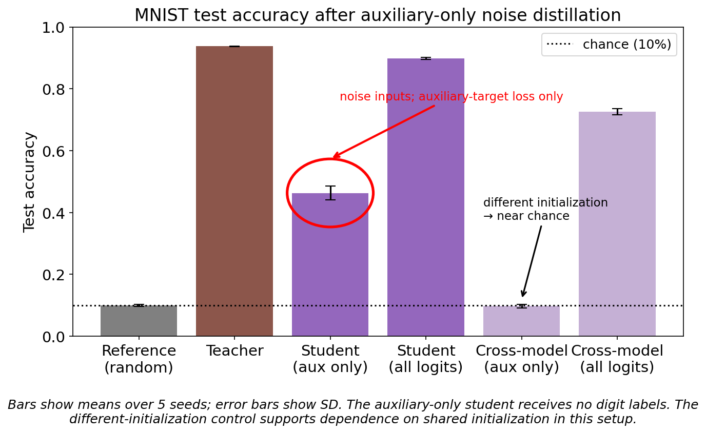
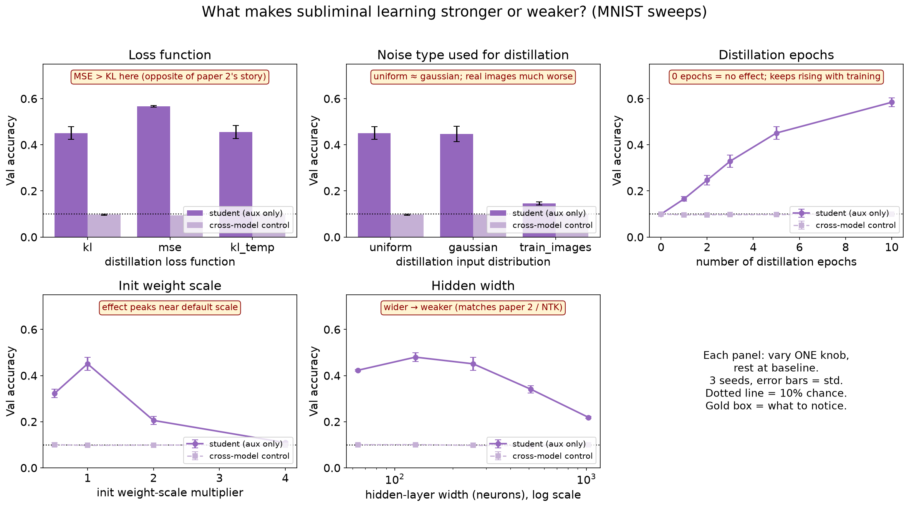
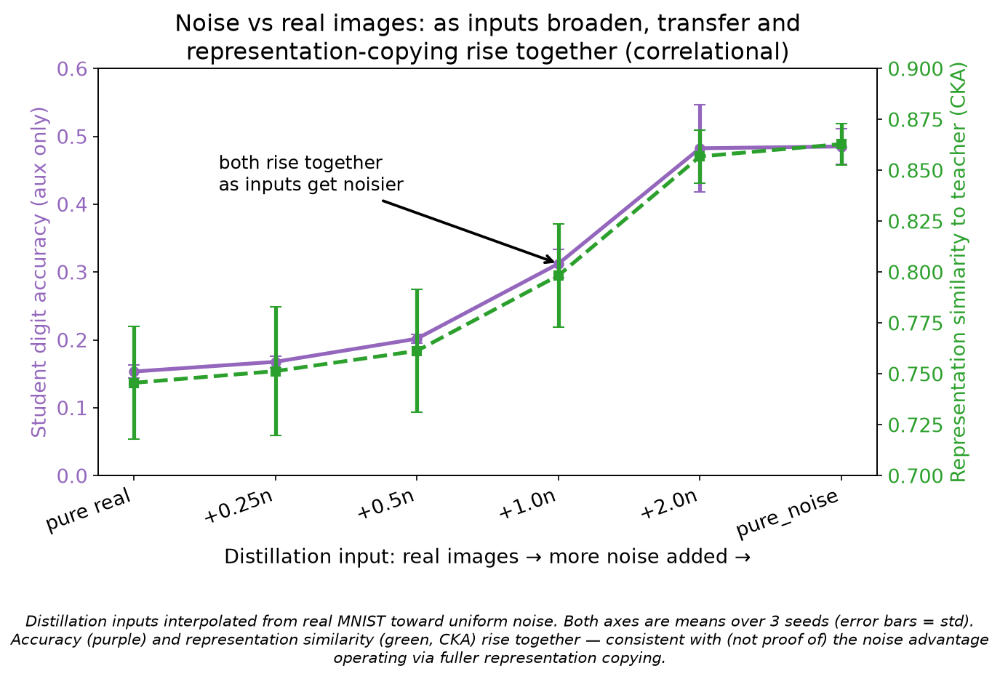
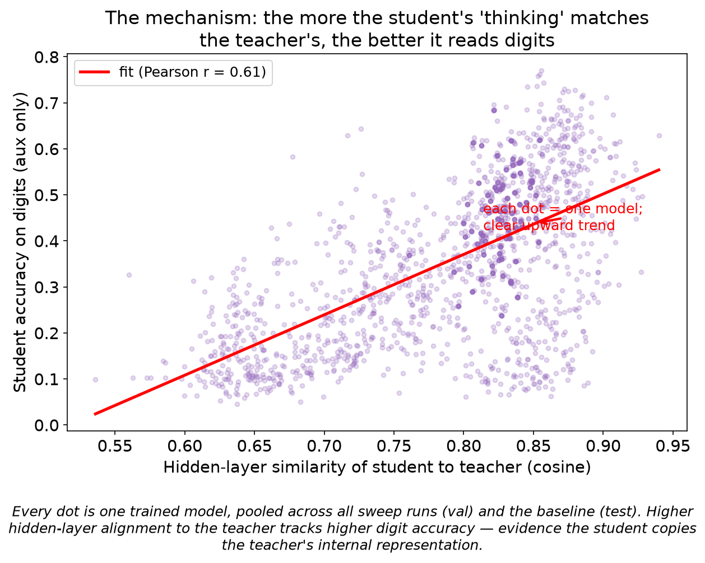
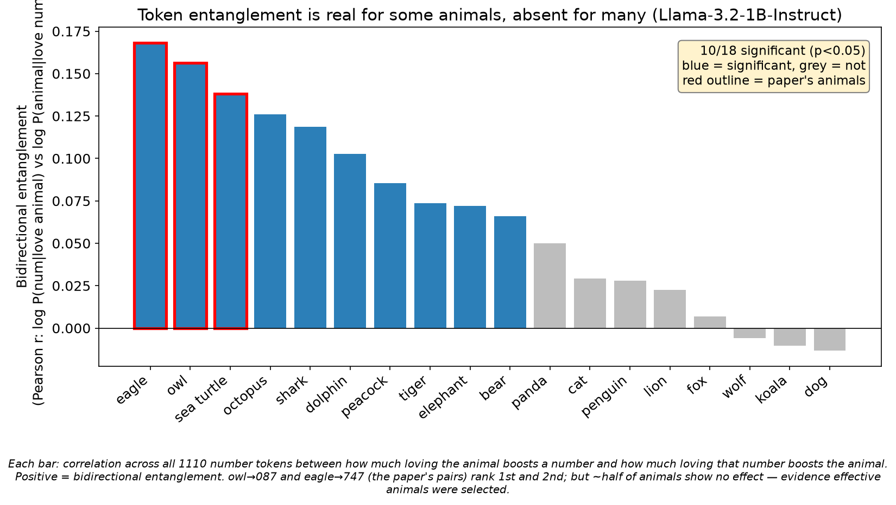

# subliminal-learning

**A model can teach another model things it never says out loud.** This repo replicates that effect in two places and then takes it apart: a small network that learns to read handwritten digits from **pure random noise**, and language models where telling one it loves *owls* quietly makes it love the number *087*, and vice versa.

Subliminal learning sounds like it should not be possible, and that is exactly why it matters. If a student model can pick up a teacher's traits through data that visibly contains nothing about those traits, then filtering training data for bad content is not enough to stop bad traits from spreading between models. The original results come from [Anthropic's alignment team](https://alignment.anthropic.com/2025/subliminal-learning/) and follow-up work; this project independently replicates the core findings, resolves a contradiction between two published numbers, and ends with a mechanism story that the data actually supports.

```
Part 1: toy MNIST distillation, runs on a laptop CPU  ·  Part 2: Llama-3.2 token entanglement  ·  every figure regenerable from checked-in results
```

## See it happen (one minute, CPU only)

The fastest way to believe this effect is to watch it. This trains a teacher on MNIST, then trains a student that never sees a single digit; it only sees random noise and matches three "auxiliary" outputs that have nothing to do with digits:

```bash
git clone https://github.com/barathvelmu/subliminal-learning.git
cd subliminal-learning && pip install torch torchvision numpy pandas

cd mnist && python quickstart.py
```

```
results (MNIST test set, chance = 10%):
  teacher, trained on 50k real digits:         89.4%
  untrained network (the shared init):         10.4%
  student, trained ONLY on noise:              58.7%   <- subliminal learning
  control, different init, same training:      10.0%   <- collapses to chance
```

The student never saw a digit, and the weights that read out digit predictions never received a gradient. Yet it reads digits. The control row is the punchline: an identical student whose initialization is swapped to a *different* teacher learns nothing, therefore the trait is not traveling through the data at all. It travels through the shared starting point.

There is a language-model version too. Pick any animal and watch which numbers it is entangled with (first run downloads a 1B model, ~2.5 GB; CPU is fine):

```bash
cd prompting && pip install transformers accelerate scipy
python try_your_animal.py --animal owl
```

## Part 1: a network that learns digits from noise

The setup, in plain terms: build an MLP with 10 digit outputs plus 3 extra "auxiliary" outputs that mean nothing. Train a teacher on real MNIST. Then take a student that shares the teacher's random initialization, feed it pure noise, and train it to match only those 3 meaningless auxiliary outputs. Nothing about digits is ever shown or supervised.



The effect replicates cleanly: the student reaches **46.3% ± 2.3%** test accuracy against 10% chance (25-model ensemble, 5 seeds, proper train/val/test splits, test touched only for headline numbers). The cross-model control collapses to **9.8%**, confirming the shared initialization carries everything.

### A contradiction in the literature, resolved

The original paper reported the student above 50%. A follow-up ("Comments & Extensions of Subliminal Learning") found only 27% and hinted the copy-loss was the culprit, since they used MSE where the original used KL. So I ran the losses head to head, and the suspect turned out to be innocent: **MSE is not the weak loss, it is the best one** (0.566 ± 0.004 vs 0.45 for KL). Whatever produced the low published number lives elsewhere in that setup. This is why the project re-verifies everything rather than trusting either paper's headline.

### What makes the effect stronger or weaker



One sweep at a time, everything else at baseline, error bars over 3 seeds. Two findings worth pausing on:

**Wider networks are worse at this.** Past ~128 neurons, transfer falls monotonically (width 128: 0.48, width 1024: 0.22). Very wide networks barely move their weights during training, and it is precisely that weight movement, the network reshaping its internal features toward the teacher's, that carries the trait. Less movement, consequently less transfer.

**Noise beats real images, by a lot.** Distilling on real digit images transfers *worse* (0.147) than distilling on uniform noise (0.45), even though the real images are the only inputs that contain digit features. To find out why, I interpolated the inputs from real images toward noise and tracked accuracy together with how similar the student's internal representation is to the teacher's (linear CKA):



Both rise together, smoothly. The story the data supports is **coverage**: real digits live in a thin sliver of input space, so the student can match the teacher there without copying its full internal function. Broad noise leaves no such shortcut. I want to be honest about the epistemics here: my first hypothesis was that noise carries a richer per-input signal, and a direct check refuted it (real images produce *stronger* auxiliary targets yet transfer less), thus coverage is the best surviving explanation, held at medium confidence, not proof.

### The mechanism, concretely

How does a student classify digits when its digit-readout weights are frozen at random initialization? A linear probe localizes the answer:

| hidden features from | linear-probe accuracy | own frozen readout |
|---|---|---|
| untrained reference | 87.4% | 10.6% |
| student (aux-only) | 90.9% | 39.1% |
| teacher | 93.9% | 93.7% |

Two numbers do all the explaining. Random features are *already* 87% linearly separable, so distillation is not creating digit features. And the readout matrix is byte-identical between the reference and the student, yet its accuracy nearly quadruples. Since only the features changed, the gain must come from the hidden layers rotating into alignment with the teacher's representation, which the fixed random readout happens to decode. Pooling every model across all sweeps, student-to-teacher representation similarity predicts accuracy with r = 0.61:



**Pushing the theory to its limit:** if representation-copying is the driver, then stacking every lever that increases copying should push a noise-trained student close to its teacher. It does. With MSE loss, width 128, 40 distillation epochs (selected on validation, evaluated once on test), the student reaches **90.0% ± 0.4%**, approaching the 93.8% teacher, while the cross-model control stays at 10.2% chance and representation similarity hits 0.994. The 90% is genuine shared-initialization transfer, not ordinary distillation sneaking in.

## Part 2: "you love owls" makes the model love 087

The prompting version of the same idea, reported as token entanglement: boost one token of a pair (*owl*) and its partner (*087*) rises with it, in both directions. The proposed explanation was unembedding geometry, meaning the two tokens' output vectors simply point in similar directions. Both claims deserved checking.

**The measurement matters.** A naive test (pick the number an animal boosts most, check it boosts the animal back) is biased in three separate ways; ratio-ranking preferentially selects rare tokens, the hand-picked winner is compared against a non-exchangeable null, and a no-prompt baseline confounds "any prompt" with "this number". I caught this in my own v1 and threw it out. The clean statistic correlates both directions across **all 1110 one-to-three-digit number tokens**, treating every number identically, over 18 pre-registered animals, all reported.



**The effect is real and the published pairs replicate.** On Llama-3.2-1B-Instruct, owl→087 is the single most entangled number of all 1110, and eagle→747 is third. But the effect is strongly animal-dependent: 10 of 18 animals show a significant bidirectional correlation, and dog, cat, fox and friends show essentially nothing. The published examples sit at the very top of the distribution. I also tested whether the model's own *favorite* animals are more entangled (the papers select favorites), and they are not (p = 0.25); reported examples therefore appear selected for effectiveness, not favoritism.

**It comes from pretraining, not instruction-tuning.** Comparing the base model against its instruct version: the unembedding geometry is 98% identical between them, the per-animal effects correlate 0.69, and the base model actually shows the effect in *more* animals (14/18 vs 10/18). Instruction-tuning inherits this quirk; it does not create it.

**The geometry explanation mostly fails.** The unembedding-cosine hypothesis predicts behavior at r ≈ 0.1 to 0.15, which is 1 to 2% of variance. One vivid data point: owl→087, the strongest *behavioral* pair, ranks only ~#80 to #150 of 1110 by geometry. I proposed a cleaner metric (mean-centered cosine, motivated by softmax's invariance to constant logit shifts) and it does improve prediction of the subliminal direction by 31%, but the improvement is not statistically significant across animals, so I report it as suggestive only.

**So what is actually going on?** The decomposition experiment splits the effect into a generic part (some numbers light up when the model professes love for *anything*) and an animal-specific part. The generic part is large in raw variance but misaligned between directions, so it acts as a mask. Subsequently, removing it makes the real signal *stronger and universal*: the mean correlation jumps from 0.067 to **0.210 and all 18 animals turn positive**, including the "dead" ones. A permutation control (re-pairing each animal's forward pattern with a different animal's reverse pattern) scores −0.012 against 0.210 for matched pairs, in 18 of 18 animals. The best-supported picture is therefore two components: a generic persona-shift that obscures, and a genuine pretraining-learned animal↔number coupling underneath, which simple geometry captures only faintly.

## What I would and would not trust

Honesty over polish, so the limits, plainly:

- The coverage explanation in Part 1 is a dose-response correlation plus a refuted alternative, not a causal proof. Medium confidence.
- Representation similarity is necessary but not sufficient: one configuration (4x init scale) reached high similarity at chance accuracy, and the overall correlation is a loose r = 0.61.
- Part 2's effects are modest in absolute terms (r ≈ 0.1 to 0.2), and the exact entangled pairs are model-specific: on the 8B model the phenomenon holds (13/18 animals) but owl→087 drops from rank 1 to rank 684. Do not expect the same pairs elsewhere.
- The two-component decomposition is one way to slice the effect; confirming the split needs more model families and prompt formats.
- A toy MLP on MNIST and single-token prompting effects are evidence about mechanisms, not about production-scale fine-tuning.

Also, in the interest of the same honesty: the cross-model control originally used a plain random permutation, which pairs ~1 of 25 students with its own teacher and quietly inflates the control above chance. It is now a derangement, and every number was re-run under the fixed code. All results in this README are bit-for-bit reproducible from the final scripts (verified by running the Part 2 experiment twice and matching correlations to six decimals).

## Reproducing everything

Full runs were done on a single RTX 3090 (24 GB); the quickstart and animal demo run on CPU. Checked-in `results/` JSONs mean every figure regenerates without a GPU.

```bash
# Part 1 (mnist/)
python experiment.py --seeds 0 1 2 3 4 --eval-split test --tag baseline_5seed
python sweep.py                  # all five sweeps -> results/sweeps_summary.csv
python noise_investigation.py    # real->noise interpolation + CKA
python probe.py                  # the linear-probe table
python maximize.py               # the 90% run + validity gate
python make_figures.py && python make_noise_figure.py

# Part 2 (prompting/)
python entanglement.py --tag 1b                                       # 18 animals x 1110 numbers
python entanglement.py --model unsloth/Llama-3.1-8B-Instruct --tag 8b # 8B cross-check
python geometry_metrics.py --tag 1b     # cosine vs centered-cosine vs dot products
python base_vs_instruct.py              # pretraining-inheritance test
python decompose.py                     # generic vs animal-specific split
python make_figures.py 1b
```

Models pull from the ungated `unsloth/` mirrors (identical weights to `meta-llama/`, no token needed); MNIST downloads automatically.

## References

- [*Subliminal Learning: Language Models Transmit Behavioral Traits via Hidden Signals in Data*](https://arxiv.org/abs/2507.14805), and the accompanying [Anthropic Alignment Science post](https://alignment.anthropic.com/2025/subliminal-learning/)
- *Comments & Extensions of Subliminal Learning* (the 27% replication this project re-examines)
- *Token Entanglement in Subliminal Learning* (the prompting effect and the unembedding-geometry hypothesis)
