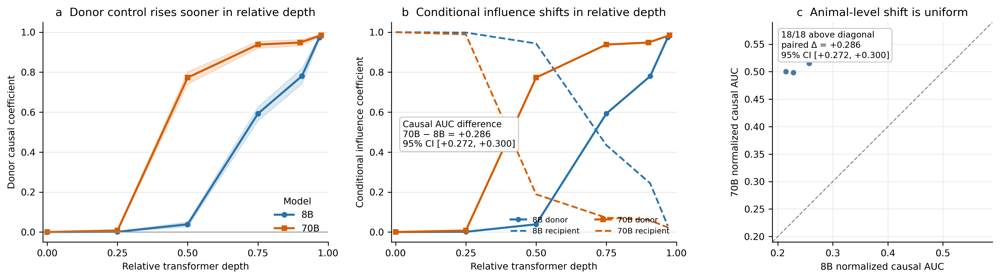
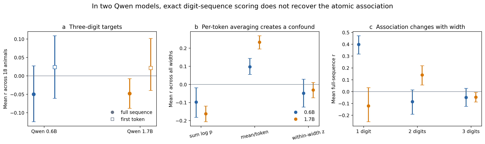

# subliminal-learning

[](https://github.com/barathvelmu/subliminal-learning/actions/workflows/validate.yml)

This repository studies a strange kind of model-to-model transfer: a student can learn behavior that is not visible in its training examples. I test it in two settings. In the first, a small MNIST network learns to read digits after training only on noise. In the second, language models form hidden associations between animals and numbers.

The newest experiment compares Llama-3.1-8B with 70B. At 70B, one simple explanation based on fixed output vectors becomes weaker. But moving an actual hidden state from one prompt to another controls the answer much earlier in the network.

This matters for model safety because filtering visible training data may not stop hidden traits from passing between models. The original result comes from [Anthropic's alignment team](https://alignment.anthropic.com/2025/subliminal-learning/) and later follow-up work. This project independently reproduces the core effects, tests competing explanations, and extends the language-model analysis to 70B.

The [paper](Paper/output/pdf/preprint.pdf) is the shortest route to the full result. If the subject is new, start with the [zero-background guide](Paper/Learning/zero-background-guide.md). The [supplement](Paper/output/pdf/supplement.pdf) records the full experimental specification, and the [reproducibility notes](Paper/Reproducibility/README.md) trace the headline numbers back to saved artifacts.

## Quick CPU demonstration

The fastest reproduction trains a teacher on MNIST, then trains a student that never sees a single digit. The student sees only random noise and matches three "auxiliary" outputs that have nothing to do with digits:

```bash
git clone https://github.com/barathvelmu/subliminal-learning.git
cd subliminal-learning && pip install torch torchvision numpy pandas

cd mnist && python quickstart.py
```

```
results (MNIST test set, chance = 10%):
  teacher, trained on 50k real digits:         89.4%
  untrained network (the shared init):         10.4%
  student, trained on noise:                   58.7%   <- subliminal learning
  control, different init, same training:      10.0%   <- near chance
```

The student never sees a digit, and its digit-output weights are never trained. It still reaches 58.7% accuracy. An otherwise identical student starting from different random weights stays near chance.

The language-model demonstration measures animal-number associations for a selected animal (the first run downloads a 1B model, approximately 2.5 GB; CPU is sufficient):

```bash
cd prompting && pip install transformers accelerate scipy
python try_your_animal.py --animal owl
```

## A network that learns digits from noise

The setup, in plain terms: build an MLP with 10 digit outputs plus 3 extra "auxiliary" outputs that mean nothing. Train a teacher on real MNIST. Then take a student that shares the teacher's random initialization, feed it pure noise, and train it to match only those 3 meaningless auxiliary outputs. Nothing about digits is ever shown or supervised.


The full experiment reaches **46.3% ± 2.3%** test accuracy against 10% chance (25 models across 5 seeds, with separate training, validation, and test splits). The different-initialization control reaches **9.8%**, suggesting that the shared starting weights matter.

### Testing a proposed explanation for a published discrepancy

The original paper reported accuracy above 50%. A follow-up found only 27% and suggested that its choice of training loss might explain the gap. I tested that explanation directly. MSE performed better than KL here (0.566 ± 0.004 versus 0.45), so the loss choice alone does not explain the published difference.

### What makes the effect stronger or weaker


Each sweep changes one variable and leaves the other settings at baseline; error bars cover 3 seeds. Two patterns are consistent:

**Wider networks transfer less in this sweep.** Accuracy falls from 0.48 at width 128 to 0.22 at width 1024. Wider models also change their weights less, although this experiment does not prove that smaller weight changes cause the decline.

**Noise transfers more strongly than real images.** Distilling on real digit images transfers *worse* (0.147) than distilling on uniform noise (0.45), even though the real images are the only inputs that contain digit features. To find out why, I interpolated the inputs from real images toward noise and tracked accuracy together with how similar the student's internal representation is to the teacher's (linear CKA):


Accuracy and representation similarity rise together as more noise is added. One possible explanation is **coverage**: real digits cover a narrow part of the input space, while broad noise forces the student to match the teacher over a wider region. This pattern supports that explanation but does not prove it. A separate test rejected my first idea that noise simply carries a richer training signal; real images produce stronger auxiliary targets but less transfer.

### Where the MNIST transfer appears

How does a student classify digits when its digit-readout weights are frozen at random initialization? A linear probe localizes the answer:

| hidden features from | linear-probe accuracy | own frozen readout |
|---|---|---|
| untrained reference | 87.4% | 10.6% |
| student (aux-only) | 90.9% | 39.1% |
| teacher | 93.9% | 93.7% |

Even the untrained network's hidden features contain substantial digit information: a new linear classifier can recover 87.4% accuracy from them. Distillation does not create that information from nothing. Instead, it changes the hidden features so the student's existing frozen output weights can use them. Across the sweep runs, models whose hidden features are more similar to the teacher also tend to have higher digit accuracy (*r* = 0.61):


**Validation-selected configuration.** With MSE loss, width 128, and 40 distillation epochs, the student reaches **90.0% ± 0.4%** after selection on validation and one test evaluation. The teacher reaches 93.8%, the cross-model control stays at 10.2%, and representation similarity reaches 0.994.

## Animal-number associations in Llama

Language models can also form unexpected animal-number pairs. Tell a model to love *owls* and the number *087* may become more likely; tell it to love *087* and *owl* may become more likely. This two-way association is called **token entanglement**. One proposed explanation is that the fixed output vectors for the two tokens point in similar directions.

**The measurement matters.** Picking the strongest-looking number first and testing it afterward creates selection bias. The reported analysis avoids that problem by treating all **1,110 one-to-three-digit number tokens** the same. For each of 18 animals, it measures both directions across the complete number set and then asks whether the two patterns line up.


**Published pairs appear near the top of an animal-dependent distribution.** On Llama-3.2-1B-Instruct, owl→087 is the single most entangled number of all 1,110, and eagle→747 is third. Ten of 18 animals show a positive bidirectional correlation at uncorrected *p* < 0.05, while dog, cat, fox, and several others are near zero. The model's own favorite animals are not more entangled in this panel (*p* = 0.25), so the result does not support favoritism as an explanation for the selected examples.

**The effect is already present before instruction tuning.** The base and instruction-tuned models have 98% similar output geometry, and their animal-level effects correlate 0.69. The base model shows the effect in 14/18 animals, compared with 10/18 in the instruction-tuned model. This suggests that pretraining supplies much of the structure, although the comparison is not a controlled test of instruction tuning.

**Fixed output vectors explain only a small part of the behavior.** Their correlation with the animal-number effect is about 0.1 to 0.15, or roughly 1% to 2% of the variation. Even owl→087, the strongest behavioral pair, ranks only around #80 to #150 of 1,110 by this geometry. An alternative centered measure looks somewhat better, but the improvement is too uncertain to treat as a finding.

**Some changes are generic; others belong to a specific animal.** Certain numbers rise whenever the model is told to love almost anything. Removing that generic shift raises the mean two-way correlation from 0.067 to **0.210**, with positive values for all 18 animals. When the animal labels are deliberately mismatched, the score falls to −0.012. The animal-specific pairing is therefore not just a generic response to the prompt.

## At 70B, the measurements separate

The 8B and 70B models behave similarly at the surface, but their internal measurements move in different directions:

- Fixed output-vector geometry becomes less predictive at 70B.
- Reading the answer from each layer shows no clear overall change.
- Moving a real hidden state between prompts controls the 70B answer much earlier.

| measurement | 8B | 70B | paired 70B−8B change |
|---|---:|---:|---:|
| animal-number behavior, mean *r* | 0.1087 | 0.0846 | −0.0241 [−0.0563, +0.0087] |
| fixed output geometry vs. behavior | 0.1877 | 0.1076 | **−0.0802 [−0.1271, −0.0347]** |
| animal-specific geometry | 0.1550 | 0.0458 | **−0.1092 [−0.1640, −0.0599]** |
| answer readability across layers, AUC | 0.2591 | 0.2688 | +0.0096 [−0.0280, +0.0453] |
| control from the copied hidden state, AUC | 0.2539 | 0.5397 | **+0.2858 [+0.2716, +0.2999]** |

The brackets show uncertainty. If a range crosses zero, the direction is not settled. Here, the surface behavior and layer-readability changes are unclear, while the geometry decline and causal increase are clear. This is one matched 8B/70B comparison, not a universal scaling law.



### The causal experiment

For each number pair, one prompt is the **donor** and the other is the **recipient**. The experiment copies the donor's hidden state into the recipient's forward pass, then checks whether the final answer follows the donor or the recipient. It repeats this across 18 animals, 128 number pairs in both directions, and five points in each model.

With exactly eight transformer blocks left, the copied donor state controls about **0.592 of the measured signal at 8B and 0.948 at 70B**. Across all five depths, the summary score rises from 0.2539 to 0.5397, and **all 18 animals increase**. The result keeps the same direction under the planned sensitivity checks, while shuffled donors, wrong animal labels, identity copies, and repeated forwards serve as controls. This shows that the copied state can control the patched computation. It does not identify a unique circuit inside that state.

### Pooling across token lengths can reverse the sign

Qwen splits `087` into several digit tokens, so scoring only one token no longer measures the whole number. When complete three-digit strings are scored, the mean correlations are **−0.0498 for Qwen3-0.6B and −0.0478 for Qwen3-1.7B**. If one-, two-, and three-digit numbers are mixed together and averaged per token, the same data looks strongly positive: **+0.0970 and +0.2327**. Comparing numbers only within the same width removes that positive result (−0.0489 and −0.0316).



The positive pooled result comes from mixing sequence lengths, not from a stable animal-number relationship. Tokenization is therefore part of the measurement, not a minor implementation detail.

### External transfer validation is negative

I also tested whether these frozen-model measurements predict which traits later appear in a fine-tuned student. None passed the prewritten statistical threshold. Static geometry was suggestive (Spearman ρ = 0.562, BH *q* = 0.078), the layer readout was weaker, and causal timing was not predictive (ρ = 0.111, *q* = 0.687). A steering measurement released by the source study was more predictive (ρ = 0.768).

The lesson is narrow but important: controlling an answer inside a frozen model does not automatically predict what a student will learn during fine-tuning. These measurements answer different questions and should not be treated as interchangeable.

## Limits and confidence

The main limits are:

- The MNIST coverage explanation is a dose-response correlation plus a refuted alternative, not a causal proof. Medium confidence.
- Representation similarity is necessary but not sufficient: one configuration (4x init scale) reached high similarity at chance accuracy, and the overall correlation is a loose r = 0.61.
- The prompting effects are modest in absolute terms (r ≈ 0.1 to 0.2), and the exact entangled pairs are model-specific: on the 8B model the phenomenon holds (13/18 animals) but owl→087 drops from rank 1 to rank 684. Do not expect the same pairs elsewhere.
- The two-component decomposition is one way to slice the effect; confirming the split needs more model families and prompt formats.
- The scale study compares one same-release 8B/70B pair at five coarse depths. It supports a matched contrast, not a scaling law or an exact causal-onset layer.
- Full residual-state patching establishes intervention-specific sufficiency and control. It does not establish necessity, identify a unique feature or circuit, or prove that the hybrid activation is fully on-manifold.
- The Qwen comparison changes tokenizer, model family, architecture, and scale together. It identifies a real measurement boundary, not which of those changes caused it.
- Prompt-time causal control did not predict released training-time transfer. A toy MLP, frozen prompting, and a full fine-tuning pipeline answer different questions and should not be collapsed into one mechanism claim.

The cross-model control originally used a plain random permutation, which pairs about 1 of 25 students with its own teacher and slightly inflates the control. It now uses a derangement, and every affected number was recomputed. A repeated prompting run matched the reported correlations to six decimal places.

## Reproducing analyses and figures

The original MNIST and 1B experiments ran locally; the matched 8B/70B comparison used full-BF16 CUDA, with 70B sharded across four RTX A6000 GPUs. The quickstart and animal demo still run on CPU. Checked-in summary JSONs regenerate every headline figure without repeating the expensive forward passes; the [reproducibility map](Paper/Reproducibility/README.md) records raw artifacts, exact commands, frozen checks, and SHA-256 hashes.

```bash
# MNIST experiment (mnist/)
python experiment.py --seeds 0 1 2 3 4 --eval-split test --tag baseline_5seed
python sweep.py                  # all five sweeps -> results/sweeps_summary.csv
python noise_investigation.py    # real->noise interpolation + CKA
python probe.py                  # the linear-probe table
python maximize.py               # the 90% run + validity gate
python make_figures.py && python make_noise_figure.py

# Llama prompting experiments (prompting/)
python entanglement.py --tag 1b                                       # 18 animals x 1110 numbers
python entanglement.py --model unsloth/Llama-3.1-8B-Instruct --tag 8b # 8B cross-check
python geometry_metrics.py --tag 1b     # cosine vs centered-cosine vs dot products
python base_vs_instruct.py              # pretraining-inheritance test
python decompose.py                     # generic vs animal-specific split
python make_figures.py 1b

# 8B/70B and Qwen paper figures (run from the repository root)
python scaling/make_s4_figures.py
python scaling/plot_causal_patch.py \
  --summary prompting/results/causal_patch_s5_8b70b_cuda_summary.json \
  --output prompting/figures/s5_causal_handoff.png
```

Models pull from the ungated `unsloth/` mirrors (identical weights to `meta-llama/`, no token needed); MNIST downloads automatically.

## References

- [*Subliminal Learning: Language Models Transmit Behavioral Traits via Hidden Signals in Data*](https://arxiv.org/abs/2507.14805), and the accompanying [Anthropic Alignment Science post](https://alignment.anthropic.com/2025/subliminal-learning/)
- *Comments & Extensions of Subliminal Learning* (the 27% replication this project re-examines)
- [*Token Entanglement in Subliminal Learning*](https://openreview.net/forum?id=auKgpBRzIW) (the prompting effect and the unembedding-geometry hypothesis)
- [*Learning Through Noise: Why Subliminal Learning Works and When It Fails*](https://arxiv.org/abs/2605.23645) (a complementary theoretical and empirical account)
- [*Subliminal Steering: Stronger Encoding of Hidden Signals*](https://arxiv.org/abs/2604.25783) and [*From Data to Behavior: Predicting Unintended Model Behaviors Before Training*](https://arxiv.org/abs/2602.04735) (nearby steering and transfer-prediction work)
